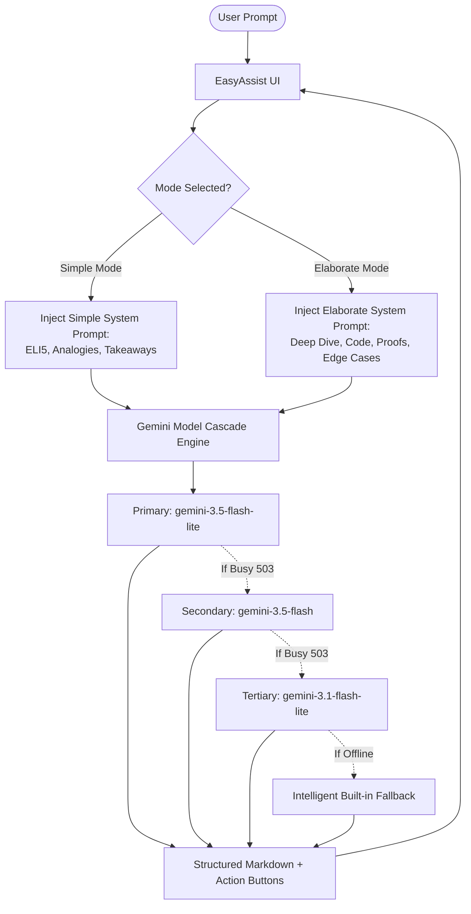

# ⚡ EasyAssist AI

> **A Universal Dual-Mode AI Chatbot — Making Knowledge About Everything in the World Simple and Deep.**

[](https://opensource.org/licenses/MIT)
[](https://nodejs.org)
[](https://react.dev)
[](https://vitejs.dev)
[](https://ai.google.dev)
[](https://threejs.org)

---

## 🌟 Overview

**EasyAssist AI** is a full-stack, ChatGPT-grade conversational artificial intelligence application designed to help users explore, understand, and master information about **anything in the world** — from quantum mechanics and computer programming to world history, philosophy, creative writing, and everyday advice.

Unlike conventional chatbots, EasyAssist AI features a **Dual Experience Engine** that adapts to how you learn:
- **Simple Mode (簡易):** Distills complex concepts into clear, beginner-friendly explanations (ELI5) anchored in relatable real-world analogies, actionable bullet points, and follow-up prompts.
- **Elaborate Mode (詳細):** Delivers exhaustive, ChatGPT-Pro level breakdowns complete with executive summaries, mathematical formulations, production-ready code with algorithmic complexity ($O(N)$), edge cases, and advanced research directions.

Wrapped in a sleek **Obsidian & Vermilion dark aesthetic** with an immersive **3D interactive sanctuary landing page**, EasyAssist AI combines visual excellence with fast, multi-turn intelligence.

---

## ✨ Key Features

- **🌐 Universal World Intelligence:** In-depth knowledge spanning STEM, coding, history, literature, philosophy, finance, health, and general inquiries.
- **⚡ Dual Experience Modes:**
  - **Simple Mode (簡易):** Direct answers, vivid real-world analogies, concise takeaways, zero overwhelming jargon.
  - **Elaborate Mode (詳細):** Comprehensive technical depth, underlying mechanics, formal proofs, and architecture blueprints.
- **🔄 In-Flight Mode Re-Generation:** Click `⚡ Elaborate this Answer` on any simple message, or `✨ Simplify this Answer` on any technical message to re-examine the answer from the opposite lens.
- **🧠 Multi-Turn Context Memory:** Automatically preserves conversation turns so you can ask follow-ups (*"Tell me more"*, *"Can you explain step 2?"*, *"Translate that to French"*).
- **🛡️ Resilient Multi-Model Gemini Cascade:** Built on the `@google/genai` SDK with an automatic fallback cascade (`gemini-3.5-flash-lite` ➔ `gemini-3.5-flash` ➔ `gemini-3.1-flash-lite` ➔ `gemini-3.8-flash`) to eliminate 503 high-demand errors and ensure zero downtime.
- **💡 Built-in Knowledge Engine Fallback:** Offline and quota-resilient heuristic engine that synthesizes structured answers even if external network access is unavailable.
- **🎙️ Voice & Audio Integration:**
  - **Speech-to-Text:** Dictate prompts hands-free using Web Speech API.
  - **Text-to-Speech:** Listen to assistant explanations with one-click voice readout.
- **💻 Rich Developer Formatting:** Syntax-highlighted code blocks with dedicated one-click copy buttons and Markdown GFM tables.
- **⛩️ 3D Sanctuary Landing Page:** Canonical Three.js / ThreeUI Kage dark aesthetic with interactive camera depth, floating dock, and seamless transition into the workspace.
- **💾 Dual Storage Architecture:** Connects to MongoDB, with automatic zero-config fallback to an atomic local file database (`data/store.json`).

---

## 🛠️ Tech Stack

### Frontend
- **Framework:** [React 18](https://react.dev/) + [Vite 6](https://vitejs.dev/)
- **Styling:** Custom Obsidian Dark Design System (`#05070a`, Vermilion `#e0231c`, Glassmorphism)
- **3D Graphics:** [Three.js](https://threejs.org/) + [@designcodeio/threeui](https://github.com/designcode)
- **Icons:** [Lucide React](https://lucide.dev/)
- **Markdown & Code:** [react-markdown](https://github.com/remarkjs/react-markdown) + [remark-gfm](https://github.com/remarkjs/remark-gfm)
- **Effects:** [canvas-confetti](https://www.npmjs.com/package/canvas-confetti)

### Backend
- **Runtime:** [Node.js](https://nodejs.org/) (ES Modules)
- **Server:** [Express 4](https://expressjs.com/)
- **AI Engine:** Google Gemini via [`@google/genai`](https://www.npmjs.com/package/@google/genai)
- **Security & Reliability:** [Helmet](https://helmetjs.github.io/), [CORS](https://www.npmjs.com/package/cors), [express-rate-limit](https://www.npmjs.com/package/express-rate-limit)
- **Persistence:** [Mongoose](https://mongoosejs.com/) (MongoDB) + Local JSON File Fallback Store

---

## 📁 Repository Structure

```text
EASYASSIST-AI/
├── package.json              # Monorepo root scripts (concurrently dev runner)
├── .env.example              # Sample environment configuration
├── backend/
│   ├── config/
│   │   └── db.js             # MongoDB connection manager with health status
│   ├── controllers/
│   │   ├── chatController.js # Multi-turn chat controller & history resolution
│   │   └── statsController.js# System metrics & telemetry
│   ├── data/
│   │   └── store.json        # Atomic local file database (auto-created fallback)
│   ├── middleware/
│   │   ├── errorHandler.js   # Centralized error handler
│   │   └── rateLimiter.js    # Rate limiting guardrails
│   ├── models/
│   │   ├── Chat.js           # Mongoose conversation schema
│   │   ├── Message.js        # Mongoose message schema
│   │   └── Feedback.js       # User rating schema
│   ├── routes/
│   │   ├── chatRoutes.js     # Chat & conversation history endpoints
│   │   └── statsRoutes.js    # Telemetry endpoints
│   ├── services/
│   │   ├── aiService.js      # Gemini client, cascade, prompts & knowledge engine
│   │   └── storeService.js   # Dual database abstraction (Mongo / File)
│   ├── .env                  # Backend environment secrets
│   ├── package.json          # Backend dependencies & scripts
│   └── server.js             # Express entry point
└── frontend/
    ├── public/               # Static assets & 3D textures
    ├── src/
    │   ├── components/
    │   │   ├── AboutModal.js # Project vision & architecture info
    │   │   ├── ChatInput.jsx # Input field with voice mic & mode switcher
    │   │   ├── ChatMessage.jsx# Message bubble with copy, speech & mode toggle
    │   │   ├── FeedbackModal.jsx
    │   │   ├── Header.jsx    # Mode selector & mobile controls
    │   │   ├── ModeToggle.jsx# Dual-mode pill switch (Simple / Elaborate)
    │   │   ├── QuickPrompts.jsx# Curated multi-domain prompt cards
    │   │   ├── SettingsModal.jsx
    │   │   └── Sidebar.jsx   # Searchable conversation drawer
    │   ├── hooks/
    │   │   ├── useChat.js    # Chat state, multi-turn history & persistence
    │   │   └── useSpeech.js  # Web Speech API recognition & synthesis
    │   ├── services/
    │   │   └── api.js        # Frontend REST API client
    │   ├── shaders/          # ThreeUI Kage 3D landing page shaders & canvas
    │   ├── styles/
    │   │   └── index.css     # Obsidian design tokens & responsive CSS
    │   ├── App.jsx           # Main orchestrator (Landing ➔ Chat view)
    │   └── main.jsx          # React DOM entry
    └── package.json          # Frontend dependencies & scripts
```

---

## 🚀 Quick Start Guide

### 1. Prerequisites
- **Node.js**: v18.0.0 or higher
- **npm**: v9.0.0 or higher
- *(Optional)* **MongoDB**: Local or MongoDB Atlas URI (if not present, the app will run seamlessly using its built-in local store).

### 2. Clone the Repository
```bash
git clone https://github.com/infantfaustin07/easyassist-ai.git
cd easyassist-ai
```

### 3. Install All Dependencies
Run from the root directory to install both backend and frontend dependencies:
```bash
npm run install:all
```

### 4. Configure Environment Variables
Create or verify your `backend/.env` file:
```env
PORT=5000
MONGODB_URI=mongodb://localhost:27017/easyassist
GEMINI_API_KEY=your_gemini_api_key_here
GEMINI_MODEL=gemini-3.5-flash-lite
AI_PROVIDER=gemini
CLIENT_URL=http://localhost:5173
```
> **Tip:** You can obtain a free Google Gemini API key at [Google AI Studio](https://aistudio.google.com/).

### 5. Run the Application Locally
To launch both Backend (`http://localhost:5000`) and Frontend (`http://localhost:5173`) concurrently:
```bash
npm run dev
```

Or run them individually in separate terminals:
```bash
# Terminal 1: Backend
npm run server

# Terminal 2: Frontend
npm run client
```

Open **`http://localhost:5173`** in your browser to experience EasyAssist AI!

---

## 📡 REST API Reference

| Method | Endpoint | Description |
|---|---|---|
| `POST` | `/api/chat` | Send a prompt, receive an AI response with multi-turn context |
| `GET` | `/api/chats` | Retrieve conversation list (supports `?search=` and `?userId=`) |
| `GET` | `/api/chats/:id` | Fetch specific conversation with all message history |
| `POST` | `/api/chats` | Create a new conversation container |
| `DELETE` | `/api/chats/:id` | Delete a conversation and its messages |
| `POST` | `/api/feedback` | Submit thumbs up/down rating and user comments |
| `GET` | `/api/stats` | Telemetry, uptime, latency metrics, and database status |

### Sample `POST /api/chat` Request
```json
{
  "message": "Explain how black holes bend time and space.",
  "mode": "simple",
  "history": [
    { "role": "user", "content": "What is gravity?" },
    { "role": "assistant", "content": "Gravity is the invisible force pulling objects together." }
  ]
}
```

### Sample Response
```json
{
  "success": true,
  "data": {
    "content": "Imagine space as a giant stretchy trampoline...",
    "latency": 2840,
    "provider": "gemini"
  },
  "chat": { "_id": "c-123", "title": "Black Holes and Gravity" },
  "meta": {
    "latencyMs": 2840,
    "provider": "gemini",
    "mode": "simple"
  }
}
```

---

## 🎯 Dual Mode Architecture



---

## 🤝 Contributing

Contributions, bug reports, and feature suggestions are always welcome!
1. Fork the Project.
2. Create your Feature Branch (`git checkout -b feature/NewFeature`).
3. Commit your Changes (`git commit -m 'Add NewFeature'`).
4. Push to the Branch (`git push origin feature/NewFeature`).
5. Open a Pull Request.

---

## 📄 License

Distributed under the **MIT License**. See `LICENSE` for more information.

---

<p align="center">
  Crafted with precision for <b>EasyAssist AI</b> · <i>Where complex ideas become clear.</i>
</p>
